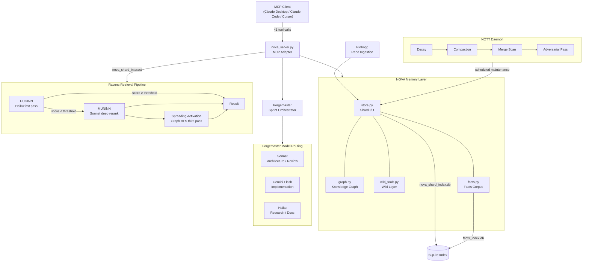

# NOVA-Cognition-Framework


[](https://opensource.org/licenses/Apache-2.0)


> **Author:** Andrei Moldovean · conceived April 2025 · first public commit March 2026  
> Original concepts: shard memory architecture, HUGINN/MUNINN retrieval pipeline, NÓTT daemon, confidence decay, shard consolidation, Forgemaster orchestration.

---

A unified repository containing **NOVA** (persistent AI memory) and **Forgemaster** (multi-agent orchestration). NOVA is the memory layer. Forgemaster is the execution layer. They share one repo and one data store.

Currently in active use as the documentation and knowledge-management backbone for multiple projects — each project keeps its own shard set with cross-project relationships tracked through the knowledge graph.

---

## What is NOVA?

NOVA is a persistent memory system for AI agents. It stores conversations and decisions as modular JSON "shards" — each with metadata, confidence scores, and decay rates. A knowledge graph tracks relationships between shards so agents can retrieve contextually relevant memory, not just recent history. A parallel **wiki layer** holds curated, evergreen pages ingested from external sources.

NOVA runs as an MCP server, meaning any MCP-compatible client (Claude Desktop, Claude Code, Cursor) can connect to it and query/write memory using structured tool calls.

**Key capabilities:**
- Semantic shard retrieval via HUGINN (Haiku fast pass) + MUNINN (Sonnet deep rerank) + spreading activation (graph-based third pass)
- Confidence-weighted recall with time-based decay
- Cluster-aware hook recall: top-k walk that collapses same-cluster results and surfaces siblings
- Anthropic prompt-cache prewarm: fires a max_tokens=0 cache-write call so subsequent requests read at ~0.1× cost
- HMAC-SHA256 embedding integrity: signs vectors at ingestion, verifies before MUNINN reranking, logs adversarial events
- NÓTT background daemon: decay, compaction, merge suggestions, graph sync
- Knowledge graph of inter-shard relationships with transitive BFS
- Three-tier discovery: index → summary → full shard (via `summary_index.json`)
- Wiki layer for curated, non-decaying knowledge
- Nidhogg ingestion pipeline with full provenance tracking
- Self-evolution loop (`nova_evolve`) for health-driven planning cycles
- Usage logging per operation to `nova_usage.jsonl`

---

## What is Forgemaster?

Forgemaster is a multi-agent orchestration layer built on top of NOVA. It decomposes tasks into typed tickets and routes each to the optimal model in a defined hierarchy.

Agents run in parallel sandboxed lanes. NOVA is Forgemaster's memory backplane: every sprint reads project context from shards and writes decisions back.

**Key capabilities:**
- Task decomposition from design docs into typed, routable tickets
- Three-tier model-adaptive routing: empirical pass rate history → complexity-keyword override → static routing table; calibrated via `nova_calibrate_routing`
- Parallel sandboxed execution lanes
- Sprint pipeline writes implementer output to disk when the design doc names a `Target file:`
- Per-call JSONL event log via `FORGEMASTER_EVENT_LOG`
- Full NOVA integration for persistent project context across sessions

---

## Agent Hierarchy

```
Architect (you)
    └── Lead (Sonnet)       — orchestration, review, ambiguous tickets
        └── Mid (Gemini Flash)  — bounded implementation, boilerplate, structured output
            └── Low (Haiku)     — research, documentation, fast tasks
```

---

## How They Connect

```
You (design doc / feature request)
        │
        ▼
  Forgemaster Orchestrator  (Sonnet)
  ├── nova_shard_interact()    → load project context from NOVA
  ├── decompose into typed tickets
  ├── route by task type
  │       ├── architecture / review / ambiguity  → Sonnet
  │       ├── implementation / boilerplate        → Gemini Flash
  │       └── research / documentation            → Haiku
  ├── parallel lanes execute
  ├── QA pass + Lead review
  └── nova_shard_update()      → write decisions back to NOVA
```

---

## Architecture Diagram



---

## Quick Start

### 1. Install dependencies

```bash
cd mcp/
pip install -r requirements.txt
```

NOVA requires **MCP Python SDK v2** (`mcp[cli]>=2,<3`), which implements spec
revision **2026-07-28**. The server imports `mcp.server.mcpserver.MCPServer` and
will not start against SDK v1 — the pin is bounded on both sides deliberately, and
a CI job installs `mcp/requirements.txt` on its own to prove a fresh install works.

Python 3.11 or 3.12. For development, install the pinned lockfile as well:

```bash
pip install -r requirements-dev.txt   # pytest, ruff, mypy + exact runtime pins
```

### 2. Configure environment

Copy `.env.example` to `.env` at the repo root and fill in your keys:

```
CLAUDE_API_KEY=sk-ant-...
GEMINI_API_KEY=...
GEMINI_MODEL=gemini-2.5-flash
```

If `CLAUDE_API_KEY` is absent, HUGINN and MUNINN silently fall back to local-only retrieval (token overlap + cosine over local embeddings).

### 3. Register in Claude Desktop

`claude_desktop_config.json`:
```json
{
  "mcpServers": {
    "nova": {
      "command": "python",
      "args": ["path/to/mcp/nova_server.py"],
      "env": {
        "NOVA_SHARD_DIR": "path/to/shards",
        "CLAUDE_API_KEY": "sk-ant-...",
        "GEMINI_API_KEY": "..."
      }
    }
  }
}
```

### 4. Run the server

```bash
python mcp/nova_server.py
```

### Docker (clean room)

Build the image — embedding model (~80 MB) is downloaded and cached during build so first boot never blocks:

```bash
docker build -t nova:latest .
```

Run interactively (seeds one health-check shard on first boot if `nova_data` volume is empty):

```bash
docker run --rm -i \
  -e CLAUDE_API_KEY=sk-ant-... \
  -e GEMINI_API_KEY=... \
  -v nova_data:/app/data \
  nova:latest
```

Register in Claude Desktop / Claude Code (`claude_desktop_config.json`):

```json
{
  "mcpServers": {
    "nova": {
      "command": "docker",
      "args": [
        "run", "--rm", "-i",
        "-e", "CLAUDE_API_KEY=sk-ant-...",
        "-e", "GEMINI_API_KEY=...",
        "-v", "nova_data:/app/data",
        "nova:latest"
      ]
    }
  }
}
```

Or use `docker-compose.yml` (copy your keys into `.env` first):

```bash
docker compose up nova
```

`NOVA_HITL_BROKER=policy` is set in the image by default. Note this no longer governs MCP tool calls: the seven destructive tools ask for approval through your MCP client (see [Approval](#approval)), which works fine in a container. The broker only covers paths with no client to ask — forgemaster's per-file writes, the Gemini worker, and bare CLI use — where `policy` denies them.

---

## Approval

Seven tools cannot be undone, so NOVA asks before running them:

`nova_shard_archive` · `nova_shard_forget` · `nova_shard_consolidate` ·
`nidhogg_ingest` · `nidhogg_scan` · `nova_evolve` · `nova_forgemaster_sprint`

The prompt arrives through your MCP client, using the protocol's elicitation
mechanism, and is asked *before* the tool runs — so declining means nothing
happened. The set is derived from the capability registry
(`tool_registry.DESTRUCTIVE_CAPABILITIES`), which is the same source as the
`destructiveHint` published to clients, so a tool can never be advertised as safe
while the gate treats it as dangerous.

**Your client must support elicitation.** One that does not cannot approve these
seven, and they will be refused with `code: "gate_denied"`. Everything else works
normally.

This is independent of `NOVA_HITL_BROKER`, which now only covers paths with no MCP
client to ask: forgemaster's per-file writes, the Gemini worker, and bare CLI use.

---

## Development & Testing

### Run the default test suite

```bash
python -m pytest tests/
```

The `benchmark` marker is excluded by default — only unit and integration tests run.

### Run the retrieval pipeline benchmark

Stage-level latency, funnel ratios, and recall@k for `nova_shard_interact` across corpus sizes 50 / 200 / 500 / 1000. Uses synthetic shards with ground-truth cluster labels; stubs the Anthropic API so the bench stays fully offline.

```bash
NOVA_BENCH=1 NOVA_BENCH_LOG=bench_retrieval.jsonl \
    python -m pytest tests/bench_retrieval.py -m benchmark -s
python utilities/bench_report.py bench_retrieval.jsonl
```

The bench measures each stage independently: SQLite facts pre-filter → HUGINN local + LLM → MUNINN local + LLM → spreading activation, plus the legacy `_walk_topk_with_cluster_collapse` walk as an off-path probe. See `tests/bench_retrieval.py` for the probe definitions.

---

## Directory Structure

```
NOVA-Cognition-Framework/
  mcp/
    # Core server
    nova_server.py           ← ACTIVE MCP server — bootstrap + wiring (registers all 41 tools)
    server_context.py        ← process-scoped singletons (ravens, NÓTT, hooks, gate, audit, session); all handlers read through ServerContext instead of module globals
    config.py                ← all env vars and defaults (single source of truth)
    schemas.py               ← Pydantic input models
    models.py                ← shared dataclasses (UsageSummary)
    requirements.txt
    SKILL.md                 ← NOVA cognitive instructions (loaded every session)
    ONBOARDING.md            ← fresh-install flow (triggered when no shards exist)

    # Shard I/O & persistence
    store.py                 ← shard JSON read/write, index/summary layer, atomic mutate_shard (lock-safe read-modify-write)
    nova_shard_db.py         ← SQLite-backed shard index (nova_shard_index.db)
    shard_format.py          ← shard serialisation helpers (.json ↔ .shard)
    shard_parser.py          ← shard parsing (used by facts.py)
    atomic_io.py             ← atomic file write primitives

    # Knowledge graph
    graph.py                 ← inter-shard graph ops (entities, relations, transitive BFS)

    # Epistemic provenance
    provenance.py            ← chain-of-custody records (source_type, validator, mechanism, confidence_delta, supersession)

    # Maintenance & lifecycle
    maintenance.py           ← confidence decay, compaction, cosine similarity, merge
    nott.py                  ← NÓTT daemon: decay, compact, merge, graph sync (lock-safe shard writes via store.mutate_shard)

    # Retrieval & ranking
    ravens.py                ← HUGINN (Haiku fast retrieval) + MUNINN (Sonnet deep rerank)
    recall.py                ← hook recall + cache prewarm + cluster-aware top-k walk
    nova_embeddings_local.py ← local all-MiniLM-L6-v2 embeddings + heuristic summaries
    clustering.py            ← shard community detection (Leiden algorithm)
    arrow_cache.py           ← Arrow-format embedding cache for vectorised cosine
    spreading_activation.py  ← graph-based score propagation as MUNINN third pass
    embedding_integrity.py   ← HMAC-SHA256 signing and verification for shard embeddings

    # Permissions, gating & audit
    permissions.py           ← env-driven tool allow/deny (NOVA_DENIED_TOOLS/PREFIXES)
    capability_gate.py       ← HITL gate keyed to skill verification level
    audit_log.py             ← per-tool HITL audit trail (SQLite, WAL mode)
    access_log.py            ← shard access logging for decay-on-read pass

    # Session & sprint
    session_store.py         ← session CRUD and flush-to-disk
    forgemaster_runtime.py   ← sprint orchestration, real LLM dispatch, biconditional audit
    usage.py                 ← JSONL operation logging
    timeutils.py             ← shared time/date helpers

    # Hook system
    hooks.py                 ← hook registry (SESSION_START, POST_SPRINT, COUNT_THRESHOLD)
    nova_hook_extract.py     ← PostToolUse hook: entity extraction on Edit/Write
    nova_hook_precompact.py  ← pre-compaction preparation hook
    nova_hook_recall.py      ← UserPromptSubmit hook: injects NOVA context into prompts
    nova_hook_stop.py        ← session-stop cleanup hook

    # Tool registry
    tool_registry.py         ← canonical ToolSpec registry; @nova_tool validates names at import

    # Skill verification
    skill_manifest.py        ← @@verification / @@capabilities header parser

    # Tool handler modules (split from nova_server.py god-object)
    shard_tools.py           ← 16 shard CRUD/lifecycle handlers (interact, create, update, validate, search, index, summary, list, get, get_full, merge, archive, forget, consolidate, query_state, obsidian_export)
    graph_tools.py           ← nova_graph_query + nova_graph_relate handlers
    session_tools.py         ← nova_session_flush / load / list handlers
    forgemaster_tools.py     ← nova_forgemaster_sprint + nova_cache_prewarm handlers
    gate_helpers.py          ← permission_error / gate_check / log_executed plumbing shared across handler modules
    reject.py                ← typed reject envelope — RejectCode enum + reject_payload()/reject_dict()
    result_middleware.py     ← server middleware: sets isError on tool results that report failure
    approval.py              ← elicitation resolver — asks the operator before a destructive tool runs
    active_request.py        ← contextvar holding the live MCP request, for code too deep to be handed a Context

    # MCP tool modules
    evolve.py                ← nova_evolve self-improvement loop
    nidhogg.py               ← nidhogg_ingest/scan/status tools
    facts.py                 ← nova_facts_search / nova_facts_rebuild
    external_retrieval.py    ← nova_external_retrieval: multi-agent deliberation pipeline with cost guard
    wiki.py / wiki_ingest.py / wiki_tools.py  ← wiki layer model, pipeline, MCP tools
    obsidian_export.py       ← Obsidian vault export logic
    build_summary_index.py   ← batch-build summary_index.json via Haiku
    adversarial.py           ← adversarial shard contradiction testing
    ternary_net.py           ← ternary epistemic memory encoder (experimental)
    calibrate.py             ← nova_calibrate_routing: HUGINN threshold + Forgemaster routing calibration

    # Tests (run with pytest from mcp/ — memory-explorer only, not pytest)
    test_nova.py             ← memory-explorer CLI (not pytest — run directly)

    Gemini/
      gemini_mcp.py          ← Gemini Flash tools registered into nova_server

  tests/                     ← main pytest suite (test_* modules, conftest.py, bench_corpus.py, bench_retrieval.py)
    golden/                  ← tool_manifest.json — golden snapshot of the published MCP surface
  utilities/                 ← migration helpers, diagnostics, ad-hoc maintenance
    # Export converters (import existing AI conversation history into NOVA)
    chatgpt_to_nova.py       ← ChatGPT conversation export → shards
    claude_to_nova.py        ← Claude (Anthropic) conversation export → shards
    gemini_to_nova.py        ← Gemini MyActivity (Google Takeout) → shards
    grok_to_nova.py          ← Grok (xAI) export → shards
    lechat_to_nova.py        ← Le Chat (Mistral) export → shards
    perplexity_to_nova.py    ← Perplexity exported threads → shards
    docs_to_nova.py          ← standalone documents (design docs, papers) → reference shards
    backfill_graph_entities.py ← register legacy / imported shards as graph entities
    backfill_provenance.py   ← seed epistemic_provenance records on shards that predate provenance.py
  docker/
    entrypoint.sh            ← seeds dummy shard on first boot, starts server
    seed/
      nova_docker_healthcheck.json  ← minimal valid shard for clean-room testing
  shards/                    ← live shard data (never edit directly)
  wiki/                      ← curated markdown pages with YAML frontmatter + [[wikilinks]]
  intake/                    ← drop zone for nidhogg_scan
  nova_sessions/             ← flushed MCP session state
  output/                    ← built artifacts, forgemaster event logs
  facts/                     ← curated .shard files for SQLite pre-filter
  forgemaster/
    AGENTS.md                ← orchestration config and model routing
    SKILL_LIBRARY.md         ← index of all skills across 25 domains
    STANDARDS.md             ← authoring standard for all forgemaster content
    skills/                  ← core orchestration skills (12 files)
    library/                 ← domain skill library (324 files, 25 categories)
    agents/                  ← agent persona definitions (221 personas, 18 divisions)
    rules/                   ← coding standards and hook rules
    slash-commands/          ← slash command definitions (commit, create-pr, brainstorm, etc.)
    templates/               ← project templates (DEBUG.md, UAT.md, UI-SPEC.md, VALIDATION.md, etc.)
    workflows/               ← reusable workflow definitions (add-phase, audit-milestone, etc.)
    docs/                    ← forgemaster reference docs
  docs/                      ← reference and roadmap documents
  Donors/                    ← reference implementations
  Dockerfile                 ← builds the MCP server image
  docker-compose.yml         ← dev/test orchestration
  .env                       ← API keys (never commit)
  .env.example               ← template (committed)
```

---

## NOVA MCP Tools (41)

Every tool is published with a human-readable title and MCP annotations derived
from its capability tag — `readOnlyHint` (22 tools), `destructiveHint` (the seven
above), `idempotentHint`, `openWorldHint` — so a client can decide what it may
auto-approve without a hardcoded list. All tools take a single `params` object.


### Core shard + graph + session (23)

| Tool | Description |
|---|---|
| `nova_shard_interact` | Load shards into context — HUGINN fast pass, MUNINN deep rerank |
| `nova_shard_create` | Create shard with post-write embedding enrichment; accepts `prov_source_type` / `prov_validator` / `prov_mechanism` to seed its epistemic provenance record |
| `nova_shard_update` | Append turn — auto-compaction triggered at threshold |
| `nova_shard_validate` | Record an epistemic validation event on a shard's provenance record (`source_type`, `validator`, `mechanism`, `confidence_delta`, supersession); positive `confidence_delta` routes through the corroboration path — confidence may only rise this way |
| `nova_shard_search` | Confidence-weighted keyword + ravens search |
| `nova_shard_index` | Compact browse rows, metadata only |
| `nova_shard_summary` | Browse rows plus a short synopsis per shard |
| `nova_shard_list` | Full raw dump (legacy; prefer index/summary) |
| `nova_shard_get` | Read full shard — no side effects |
| `nova_shard_get_full` | Cold-path full-body fetch — returns summary + conversation body |
| `nova_shard_query_state` | Query SQLite shard index by epistemic state vector (confidence, valence, arousal) |
| `nova_shard_merge` | Merge shards into meta-shard, updates graph |
| `nova_shard_archive` | Soft-archive — excluded from search, preserved on disk |
| `nova_shard_forget` | Hard exclude with provenance log |
| `nova_shard_consolidate` | Full NÓTT cycle: decay + compact + merge suggestions |
| `nova_obsidian_export` | Export shard set as Obsidian-compatible markdown vault |
| `nova_graph_query` | Query knowledge graph (direct or transitive BFS) |
| `nova_graph_relate` | Add directed relation between shards |
| `nova_session_flush` | Persist active session to disk |
| `nova_session_load` | Restore flushed session to memory |
| `nova_session_list` | List all persisted session IDs |
| `nova_forgemaster_sprint` | Full 4-turn sprint pipeline |
| `nova_cache_prewarm` | Fire a max_tokens=0 cache-write call with top-N shard summaries so subsequent requests receive Anthropic cache reads |

Relation types: `influences`, `depends_on`, `contradicts`, `extends`, `references`, `merged_from`, `supersedes`, `corroborated_by`.

### Wiki (6)

| Tool | Description |
|---|---|
| `nova_wiki_schema` | Inspect or edit the wiki page schema |
| `nova_wiki_ingest` | Ingest markdown/source into the wiki |
| `nova_wiki_query` | Search across wiki pages |
| `nova_wiki_get` | Read a single wiki page in full |
| `nova_wiki_list` | List wiki pages (optionally by category) |
| `nova_wiki_lint` | Lint wiki content for schema compliance |

Wiki pages live in `wiki/` as markdown with YAML frontmatter and `[[wikilinks]]`. They are evergreen — they do not decay — and are only created/updated via `nova_wiki_ingest`.

### Nidhogg — repo/document ingestion (3)

| Tool | Description |
|---|---|
| `nidhogg_ingest` | Ingest a single file by path |
| `nidhogg_scan` | Scan `intake/` and ingest all pending files |
| `nidhogg_status` | Show manifest of ingested file hashes |

Nidhogg is non-destructive: it appends a `nidhogg` block to matched shards (atomically, via `store.mutate_shard`, so a concurrent conversation turn is never clobbered) and never rewrites existing fields. `ingest`/`scan` are irreversible-write tools and route through the capability gate. Idempotent via SHA256 manifest.

### Facts (2)

| Tool | Description |
|---|---|
| `nova_facts_search` | Search the SQLite-backed `.shard` facts corpus |
| `nova_facts_rebuild` | Rebuild the facts index from shard sources |

### External retrieval (1)

| Tool | Description |
|---|---|
| `nova_external_retrieval` | Multi-agent external-knowledge deliberation: Haiku retrieval + parallel validate/challenge/synthesize, Sonnet arbiter (ACCEPT/PARTIAL/REJECT). On ACCEPT/PARTIAL writes a claim shard + debate-log shard linked by a `references` edge. A cost guard aborts before any API call if the estimate exceeds `NOVA_EXTERNAL_COST_CAP` (default $0.10). |

### Evolution (1)

| Tool | Description |
|---|---|
| `nova_evolve` | Run one self-evolution cycle: analyze → verify → commit → govern → plan |

> ⚠ **Side effect:** `nova_evolve` runs `git add` and `git commit` locally when tests pass, staging only allowlisted paths (`EVOLVE_COMMIT_ROOTS`, default `mcp/ forgemaster/ tests/ docs/`). On test failure it rolls the changes back with `git stash push` (recoverable via `git stash list`), not a destructive `checkout`. Nothing is pushed to a remote. It carries a destructive capability, so it asks for your approval on every call regardless of skill verification. Use `dry_run=true` for just the director prompt — a dry run is ungated and mutates nothing. If `mcp/` changed, it writes `.sdd/runtime/restart_requested`.

### Gemini (2)

Registered into `nova_server` via `mcp/Gemini/gemini_mcp.py`:

| Tool | Description |
|---|---|
| `gemini_execute_ticket` | Send a structured ticket to Gemini Flash |
| `gemini_load_file` | Load a file from disk as codebase context (repo-root scoped; refuses credential/secret files such as `.env`, `*.key`, `*.pem`) |

### Calibrate (1)

| Tool | Description |
|---|---|
| `nova_calibrate_routing` | Analyse HUGINN consistency per confidence bucket and Forgemaster sprint pass rates by model; suggests threshold adjustments. Read-only — no state changes. |

### HUGINN orchestration (1)

| Tool | Description |
|---|---|
| `nova_huginn_candidates` | Keyword + confidence pre-filter over the shard index. Returns a small candidate list ready to paste into a HUGINN agent prompt — no LLM call, so it costs nothing. |

### Code index (1)

| Tool | Description |
|---|---|
| `nova_code_search` | Semantic search over `mcp/**/*.py`, AST-chunked at function/class granularity and embedded locally. Use instead of grep when you know *what* you are looking for but not the file or symbol name. |

### MCP Resources

Read-only resources exposed alongside the tools. Each publishes a name, title,
description and MIME type:

| URI | Title | MIME type | Contents |
|---|---|---|---|
| `nova://skill` | NOVA Skill Definition | `text/markdown` | `mcp/SKILL.md` — the operating protocol |
| `nova://index` | Shard Index | `application/json` | One metadata row per shard, rebuilt on read |
| `nova://graph` | Shard Knowledge Graph | `application/json` | Every directed inter-shard relation |
| `nova://usage` | Operation Log and Token Usage | `application/json` | Last 100 log entries + session token totals |

Two resource *templates* give the corpus addressable URIs, so a shard or a page
can be linked and embedded in a prompt rather than reached only through a tool:

| URI template | Title | MIME type | Contents |
|---|---|---|---|
| `nova://shard/{shard_id}` | Shard | `application/json` | One shard as stored on disk — the read-only equivalent of `nova_shard_get` |
| `nova://wiki/{slug}` | Wiki Page | `text/markdown` | One curated wiki page — the read-only equivalent of `nova_wiki_get` |

Both parameters support argument completion (`completion/complete`): shard ids
come from the SQLite index's primary key, wiki slugs from the union of the
schema and the pages on disk.

A resource that serves the same data as a tool is closed by that tool's
denial — denying `nova_shard_get` also closes `nova://shard/{id}`. `nova://skill`
and `nova://usage` mirror no tool and stay open.

### MCP Prompts

Twenty prompts, listed by `prompts/list`:

| Prompt | Arguments | Purpose |
|---|---|---|
| `nova-orient` | `project` | Load what NOVA knows about a project and summarise the current state |
| `nova-recall` | `shard_id`, `depth` | One shard plus everything the graph connects it to |
| `nova-write-handoff` | `project` | Apply the handoff test, then write one only if it passes |
| `nova-ingest-document` | `path` | Route a document to the shard graph or the wiki |
| `nova-run-sprint` | `sprint_id`, `design_doc`, `shard_ids` | Load context, then run the four-turn sprint |
| `nova-audit-confidence` | `min_confidence` | Find contradicted, low-confidence and stale shards |
| `forgemaster-*` (14) | — | One per file in `forgemaster/skills/`, generated from the directory |

The skill prompts cover the fourteen **core** skills only. The 218 skills in
`forgemaster/library/` are reachable through `SKILL_LIBRARY.md`; serving them as
prompts would be an unusable menu.

---

## Module Architecture

`nova_server.py` is a thin MCP adapter. All business logic lives in dedicated modules:

| Module | Responsibility |
|---|---|
| `config.py` | Single source for all env vars and defaults |
| `schemas.py` | Pydantic input models for core + wiki tools |
| `models.py` | Shared dataclasses (UsageSummary) |
| `server_context.py` | Process-scoped singleton container (`ServerContext`); `bootstrap()` constructs all components in dependency order and wires hook bus — handler modules read singletons through `ctx` instead of module globals |
| `tool_registry.py` | Canonical `ToolSpec` registry — `@nova_tool` validates names at import, feeds permissions/audit/docs |
| `shard_tools.py` | 16 shard CRUD/lifecycle MCP tool handlers — `register_shard_tools(mcp, ctx)` wires them; reads singletons through `ServerContext` |
| `graph_tools.py` | `nova_graph_query` + `nova_graph_relate` handlers — `register_graph_tools(mcp, ctx)` |
| `session_tools.py` | `nova_session_flush` / `nova_session_load` / `nova_session_list` handlers — `register_session_tools(mcp, ctx)` |
| `forgemaster_tools.py` | `nova_forgemaster_sprint` + `nova_cache_prewarm` handlers — `register_forgemaster_tools(mcp, ctx)` |
| `gate_helpers.py` | `permission_error` / `gate_check` / `log_executed` — shared capability-gate plumbing for all handler modules |
| `reject.py` | The two error envelopes. `status="rejected"` carries a machine-readable `RejectCode`, a `retryable` flag and a `hint`; `status="error"` is reserved for unexpected exceptions. `reject_payload()` returns the JSON string, `reject_dict()` the dict for helpers that build a payload for their caller |
| `result_middleware.py` | Server middleware that sets `isError` on any tool result reporting a failure, so a client can tell a refusal from a success without parsing the body. Also records the live request for `approval.py` |
| `approval.py` | Asks the operator before a destructive tool runs, through MCP elicitation. Exposes the `Approval(tool)` parameter annotation and `was_approved()`; the gate keeps the policy and the audit trail |
| `active_request.py` | ContextVar holding the request being served, so the capability gate can reach the client session without threading a `Context` through every handler |
| `store.py` | Shard filesystem I/O, index, summary-index layer, path-traversal guards; `mutate_shard`/`mutate_shard_fields` give lock-safe read-modify-write (fresh read inside the FileLock) plus revision-guarded CAS, closing the NÓTT ↔ tool-write lost-update race |
| `graph.py` | Knowledge graph load/save/query/relate/transitive BFS |
| `provenance.py` | Epistemic provenance records at `meta_tags.epistemic_provenance` — `source_type` authority taxonomy (`self_inferred` → `peer_validated` → `authority_validated` → `externally_published`), append-only validation-event log, supersession flags. Confidence only ever rises through `maintenance.apply_confidence_corroboration`; this module routes positive `confidence_delta` through that path and never lowers confidence directly |
| `maintenance.py` | Confidence decay, auto-compaction, cosine similarity, merge candidates |
| `permissions.py` | Env-driven tool allow/deny |
| `hooks.py` | Event-driven hook registry (SESSION_START, POST_SPRINT, COUNT_THRESHOLD) |
| `usage.py` | JSONL operation logging |
| `session_store.py` | Session CRUD and flush-to-disk |
| `forgemaster_runtime.py` | Sprint orchestration — three-tier adaptive model routing, dispatch, outcome + routing event logging |
| `calibrate.py` | HUGINN threshold calibration + Forgemaster routing stats — analyses `nova_usage.jsonl` and sprint event logs, suggests threshold adjustments |
| `ravens.py` | HUGINN (Haiku fast retrieval) + MUNINN (Sonnet deep rerank) |
| `spreading_activation.py` | Damped BFS over the knowledge graph — MUNINN third retrieval pass with cluster-boundary penalties |
| `recall.py` | Hook recall + cache prewarm + cluster-aware top-k walk (collapses same-cluster results, collects siblings over 2×top_k window) |
| `embedding_integrity.py` | HMAC-SHA256 signing at ingestion, signature verification before MUNINN cosine reranking, adversarial event log |
| `nott.py` | NÓTT daemon — scheduled decay, compact, merge, graph sync (dedicated `ThreadPoolExecutor`, isolated from default executor); every pass writes via `store.mutate_shard`, so background maintenance never clobbers a concurrent tool write (compaction uses a revision-guarded CAS) |
| `nova_embeddings_local.py` | Local embeddings + heuristic compaction summaries (non-blocking `get_embedding_model_if_ready()` used on enrichment path) |
| `capability_gate.py` | Capability membership check plus the approval policy: a destructive capability requires human approval whatever the skill claims. The seven destructive tools ask through MCP elicitation (see `approval.py`); the fallback brokers cover only paths with no client to ask. Executions emit audit records covered by the biconditional corpus check |
| `audit_log.py` | SQLite HITL audit log — four-state lifecycle + biconditional corpus check |
| `skill_manifest.py` | Parses `@@verification` / `@@capabilities` from skill file headers |
| `external_retrieval.py` | `nova_external_retrieval` — Haiku retrieval + parallel validate/challenge/synthesize + Sonnet arbiter with ACCEPT/PARTIAL/REJECT verdict; cost-guard aborts if estimate exceeds `NOVA_EXTERNAL_COST_CAP` |
| `evolve.py` | Self-evolution loop, adaptive governor, auto-commit |
| `nidhogg.py` | Document ingestion with provenance |
| `wiki.py` / `wiki_ingest.py` / `wiki_tools.py` | Wiki layer model, pipeline, and MCP tools |
| `build_summary_index.py` | Batch-build `summary_index.json` via Haiku |

---

## Stability: Production vs Experimental

### Production-critical (stable, supported)
- `mcp/nova_server.py` and exported MCP tools
- Core runtime modules: `mcp/store.py`, `mcp/graph.py`, `mcp/maintenance.py`, `mcp/forgemaster_runtime.py`, `mcp/permissions.py`, `mcp/session_store.py`, `mcp/hooks.py`, `mcp/tool_registry.py`
- Retrieval and indexing pipeline: `mcp/ravens.py`, `mcp/recall.py`, `mcp/spreading_activation.py`, `mcp/embedding_integrity.py`, `mcp/nova_embeddings_local.py`, `mcp/build_summary_index.py`
- Wiki and ingestion modules: `mcp/wiki.py`, `mcp/wiki_ingest.py`, `mcp/wiki_tools.py`, `mcp/nidhogg.py`

### Experimental / internal tooling (may change without compatibility guarantees)
- `utilities/` scripts (migration helpers, diagnostics, ad-hoc maintenance tools)
- `utilities/test_nova.py` memory explorer CLI
- Planning/reference docs under `docs/` and donor/reference materials under `Donors/`
- `forgemaster/library/` and `forgemaster/agents/` skill/persona content

---

## Key Environment Variables

> For the complete environment-variable reference with impact explanations, see [docs/CONFIG.md](docs/CONFIG.md).

| Variable | Default | Notes |
|---|---|---|
| `NOVA_DATA_ROOT` | `cwd` | Root directory for all data files (shards, sessions, summary index, usage log). Override to pin to a specific directory; all relative paths in `config.py` resolve under this root |
| `NOVA_SHARD_DIR` | `shards` | Path to shard JSON files (resolved under `NOVA_DATA_ROOT`) |
| `CLAUDE_API_KEY` | — | Powers HUGINN + MUNINN + wiki + summary generation |
| `HUGINN_MODEL` | `claude-haiku-4-5-20251001` | Fast retrieval pass |
| `MUNINN_MODEL` | `claude-sonnet-4-6` | Deep rerank pass |
| `HUGINN_CONFIDENCE_THRESHOLD` | `0.7` | Score ≥ this skips MUNINN |
| `RAVEN_API_TIMEOUT` | `10` | Per-call LLM timeout (seconds) before local fallback |
| `GEMINI_API_KEY` | — | Required for Gemini worker |
| `GEMINI_MODEL` | `gemini-2.5-flash` | Implementation lane model |
| `FORGEMASTER_ORCHESTRATOR_MODEL` | inherits `MUNINN_MODEL` | Override the orchestrator role's model — set to an Opus alias on high-stakes sprints |
| `FORGEMASTER_PLANNER_MODEL` | inherits `MUNINN_MODEL` | Override the planner role's model |
| `FORGEMASTER_REVIEWER_MODEL` | inherits `MUNINN_MODEL` | Override the reviewer role's model |
| `FORGEMASTER_IMPLEMENTER_MODEL` | inherits `GEMINI_MODEL` | Override the implementer role's model; `claude-*` IDs route to Anthropic automatically |
| `NOVA_COMPACT_THRESHOLD` | `30` | Turns before auto-compaction |
| `NOVA_COMPACT_KEEP` | `15` | Recent turns retained after compaction |
| `NOVA_DECAY_RATE` | `0.05` | Confidence decay per 7-day period |
| `NOVA_DECAY_DAYS` | `7` | Days per decay period |
| `NOVA_DECAY_ON_READ_WINDOW_DAYS` | `7` | Window (days) for the decay-on-read pass; shards accessed more recently than this are exempt |
| `NOVA_MERGE_THRESHOLD` | `0.85` | Cosine similarity floor for merge suggestions |
| `NOVA_CONFIDENCE_LOW` | `0.4` | Below this → `low_confidence` tag |
| `NOVA_RECENT_DAYS` | `3` | Within N days → `recent` tag |
| `NOVA_STALE_DAYS` | `14` | Not accessed N days → `stale` tag |
| `NOTT_COUNT_THRESHOLD` | `100` | Shard count triggering NÓTT merge scan |
| `NOVA_QUARANTINE_HOURS` | `48` | Hours a shard remains quarantined after failing the adversarial pass |
| `NOVA_QUARANTINE_PENALTY` | `0.5` | Retrieval score multiplier applied to quarantined shards |
| `NOVA_ADVERSARIAL_INTERVAL_DAYS` | `7` | Minimum days between adversarial passes on the same shard |
| `NOVA_HITL_BROKER` | `interactive` | Fallback broker only — MCP tool calls ask through elicitation and ignore this. Covers forgemaster per-file writes, the Gemini worker and bare CLI. `interactive` (terminal prompt, denies without a terminal) or `policy` (always-deny — set in the Docker image) |
| `NOVA_HITL_TIMEOUT_S` | `30` | Seconds before an unanswered *terminal* prompt auto-denies. Elicitation prompts are not bounded by this — the client owns that timeout |
| `NOVA_DENIED_TOOLS` | — | Comma-separated tool names to block |
| `NOVA_DENIED_PREFIXES` | — | Comma-separated prefixes to block |
| `NOVA_PROJECT_CONTEXT` | — | Freeform project context string injected into sprint prompts |
| `NOVA_SUMMARY_INDEX_FILE` | `summary_index.json` | Path to summary index |
| `NOVA_SUMMARY_MARKDOWN_FILE` | `summary_index.md` | Path to summary markdown |
| `NOVA_WIKI_DIR` | `wiki` | Wiki pages directory |
| `NOVA_WIKI_SCHEMA` | `wiki_schema.json` | Wiki schema file |
| `NOVA_WIKI_INDEX` | `wiki_index.json` | Wiki embedding index |
| `NOVA_WIKI_ROUTING_MODEL` | `claude-haiku-4-5-20251001` | Wiki ingest routing model |
| `NOVA_WIKI_SYNTHESIS_MODEL` | `claude-sonnet-4-6` | Wiki synthesis model |
| `NIDHOGG_INTAKE_DIR` | `intake` | Nidhogg drop zone |
| `NIDHOGG_MANIFEST_FILE` | `nidhogg_manifest.json` | Ingested-hash manifest |
| `NIDHOGG_SIMILARITY_THRESHOLD` | `0.55` | Shard-match threshold for annotation |
| `FORGEMASTER_EVENT_LOG` | — | Override path for sprint JSONL event log |
| `NOVA_EMPIRICAL_CACHE_TTL_S` | `300` | Empirical routing stats cache TTL (seconds); lower this to pick up new sprint outcomes faster in long-running servers |
| `NOVA_RECALL_CACHE_TTL` | `300` | In-memory recall cache TTL in seconds |
| `NOVA_ACTIVATION_MIN_EDGES` | `10` | Minimum graph edges required to run spreading activation |
| `NOVA_EXTERNAL_COST_CAP` | `0.10` | USD cost ceiling for `nova_external_retrieval`; request is aborted before any API call if the estimate exceeds this |
| `NOVA_EXTERNAL_RETRIEVAL_THRESHOLD` | `0.6` | Minimum confidence score before external retrieval is considered worth firing |
| `NOVA_EMBEDDING_HMAC_KEY` | — | Hex or UTF-8 secret for HMAC-SHA256 embedding signing; if unset, signing is skipped |
| `NOVA_EMBEDDING_INTEGRITY_LOG` | `embedding_integrity.jsonl` | Path for adversarial embedding event log |

---

## Error Handling

Every payload carries a `status`, and a failed call sets `isError` on the wire, so
a client can tell a refusal from a success without parsing the body:

| `status` | Meaning |
|---|---|
| `"rejected"` | The tool refused for a known reason. Carries a machine-readable `code` (`shard_not_found`, `permission_denied`, `gate_denied`, `quarantined`, `invalid_input`, `duplicate`, …), a `retryable` flag, a `hint` naming the next useful action, and often a `target`. Read the `code` rather than the message. |
| `"error"` | Something unexpected broke. |
| anything else | Success — `"created"`, `"updated"`, `"flushed"`, `"ok"` and friends. |

An operator declining an approval prompt arrives as `rejected` /
`gate_denied` with `retryable: true`.

Every tool also publishes a real `outputSchema` derived from a Pydantic model in
`mcp/outputs.py`, and returns `structuredContent` matching it. A handler that can
refuse is annotated `Success | RejectPayload`, so the published schema describes
both shapes; the SDK nests `structuredContent` under a `result` key for those
unions. The text block is still emitted alongside, so nothing that parses the
body breaks.

Operational failure modes:

| Scenario | Behavior |
|---|---|
| `CLAUDE_API_KEY` absent | HUGINN and MUNINN silently fall back to local-only retrieval (token overlap + cosine over local all-MiniLM-L6-v2 embeddings). No error is raised; retrieval quality is reduced. |
| HMAC signature mismatch | The embedding is rejected before MUNINN reranking. The event is written to `embedding_integrity.jsonl` (shard ID, timestamp, expected vs. actual signature). Retrieval continues without the tainted vector. |
| MCP client disconnection | The server continues running. The stop hook (`nova_hook_stop.py`) flushes active session state to `nova_sessions/` so the next `nova_session_load` can resume where the session left off. |
| API rate limit / timeout | `RAVEN_API_TIMEOUT` (default `10`s) controls the per-call LLM timeout. On timeout, the MUNINN step is skipped and HUGINN's local-pass result is returned. |
| Shard fails adversarial pass | The shard is quarantined for `NOVA_QUARANTINE_HOURS` (default `48`h). During quarantine its retrieval score is multiplied by `NOVA_QUARANTINE_PENALTY` (default `0.5`) and it is excluded from default search. It graduates automatically if the next NÓTT adversarial pass clears it. |

---

## Prior Art & Attribution

Original architecture documented before any public commit. These documents establish authorship of the core concepts:

| Document | Date |
|---|---|
| NOVA Framework (concept doc) | April 2025 |
| Executive Summary | April 2025 |
| NOVA Shard Memory Architecture | April 2025 |
| Unified Consciousness Model | April 2025 |
| First public commit | March 2026 |

Original named concepts in this repository: **shard** (memory unit), **HUGINN/MUNINN** (retrieval pipeline), **NÓTT** (maintenance daemon), **confidence decay**, **shard consolidation**, **Forgemaster** (orchestration layer).

---

## Notes

- Never manually edit files in `shards/` or `wiki/` — always use the MCP tools
- Auto-generated files, never commit: `shard_index.json`, `shard_graph.json`, `summary_index.json`, `summary_index.md`, `wiki_index.json`, `nidhogg_manifest.json`, `nova_usage.jsonl`, `evolve_cycles.jsonl`, `evolve.json`, `embedding_integrity.jsonl`
- `.env` contains API keys — never commit it
- `test_nova.py` is a memory-explorer CLI, not a pytest suite — run it with `python utilities/test_nova.py`
- See `CLAUDE.md` for operational instructions and sprint workflow; see `docs/ROADMAP.md` for shipped-vs-planned split
- See `KNOWN_ISSUES.md` for open and resolved bugs with workarounds
