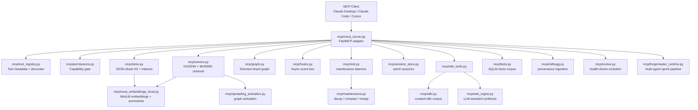

# NOVA AI Architecture Summary

This document is an AI-readable architecture map for the NOVA Cognition Framework. It summarizes the live system, the important design contracts, the data model, the runtime flow, and the main extension points so another AI agent can understand how the repository fits together before changing it.

---

## 1. Executive summary

NOVA is a persistent cognition and memory framework for stateless AI agents. Its central premise is that intelligence should be supported by structured, revisitable memory rather than by relying on a single model's context window. NOVA stores durable memory in modular units called **shards**, enriches those shards with summaries, embeddings, confidence scores, provenance, and graph relations, and exposes the whole system as an MCP server.

The repository contains two tightly coupled systems:

1. **NOVA memory layer** — shard storage, retrieval, graph navigation, maintenance, wiki/facts corpora, ingestion, session persistence, and self-evolution tooling.
2. **Forgemaster execution layer** — a multi-agent sprint/orchestration runtime that uses NOVA as a persistent memory backplane.

In operational terms, an MCP client calls `mcp/nova_server.py`; the server validates and gates tool calls; the tool handlers read or mutate shard/wiki/session files; retrieval uses embeddings, confidence, and graph traversal; maintenance runs through hooks; usage and audit trails are written to JSONL; and Forgemaster can turn a design request into a multi-step LLM sprint.

---

## 2. Architectural philosophy

NOVA treats the LLM as a **stateless processor** and moves continuity into external memory. The system is optimized around these principles:

- **Memory is reconstructed, not retained.** Each interaction loads relevant shards back into the model context rather than assuming continuity.
- **Structure beats raw context length.** Retrieval uses summaries, confidence, tags, graph relations, and embeddings to select concise context.
- **Shards are atomic cognitive units.** A shard should have one guiding question or claim and should connect to related shards through typed graph edges rather than absorbing unrelated content.
- **Confidence decays instead of deleting knowledge.** Old or unused memory sinks in ranking but remains deliberately recoverable.
- **Contradiction is signal.** Graph relations can mark shards as contradictory, dependent, influential, or extending one another, allowing the agent to reason across tensions.
- **Maintenance is part of cognition.** Decay, compaction, merge suggestions, graph sync, and enrichment are first-class background behaviors.

---

## 3. Repository map

The most important top-level areas are:

| Path | Role |
|---|---|
| `mcp/` | Live MCP server implementation and core runtime modules. |
| `docs/design/` | Design documentation for modules, utilities, and future architecture plans. |
| `docs/recent/` | Research/reference notes that inform architecture decisions and roadmap work. |
| `utilities/` | Standalone migration, indexing, conversion, diagnostics, and analysis scripts. |
| `forgemaster/` | Multi-agent orchestration layer, personas, standards, and skills. |
| `tests/` | Pytest coverage for runtime behavior, maintenance, ingestion, graph, sessions, facts, and Forgemaster. |
| `docker/`, `Dockerfile`, `docker-compose.yml` | Container startup and deployment path. |

A new AI agent should start by reading this file, `README.md`, `mcp/SKILL.md`, `docs/design/INDEX.md`, and `mcp/tool_registry.py`.

---

## 4. Live runtime topology

At runtime, `mcp/nova_server.py` is the assembly root. It constructs singleton services, registers MCP tools, wires hooks, and exposes the server to MCP-compatible clients.



Important dependency rule: `nova_server.py` is the top of the import tree for the live server. Most modules should not import it; they should be called by it or registered into it.

---

## 5. Data model

### 5.1 Shards

The live system primarily operates on JSON shard files. A shard represents a focused memory thread and typically contains:

- `shard_id` — stable identifier.
- `guiding_question` — the central question or cognitive anchor.
- `conversation_history` or turn-like content — user/assistant exchanges or imported material.
- `meta_tags` — intent, theme, usage count, timestamps, confidence, decay metadata, archive/forget status, enrichment status, and related metadata.
- `context` — summary, topics, conversation type, embedding vector, compaction metadata, and last context update.
- provenance or ingestion blocks — especially when updated by Nidhogg or validation tooling.

Design intent: each shard should remain narrow enough that its embedding and summary correspond to one coherent question, claim, or work thread.

### 5.2 Confidence and decay

Shards carry confidence in the live JSON model as a float. Retrieval weights relevance by confidence, so high-confidence and recently used memory rises in results. Maintenance decays stale shards and boosts recently interacted shards. Low-confidence shards are not deleted; they become colder and require more deliberate search.

There is a planned/newer `.shard` parser and discrete ternary confidence direction in `mcp/shard_parser.py`, plus a structured integer state encoding design in `docs/design/NOVA_Shard_Encoding_Design_Doc.md`. However, the live MCP server still primarily uses JSON shards and float confidence. Treat this as an active migration boundary.

### 5.3 Indexes and summaries

NOVA avoids loading full shard bodies when orienting. It supports a hierarchy:

1. **Index-level browsing** — compact metadata rows.
2. **Summary-level browsing** — concise summaries and selected metadata.
3. **Full shard retrieval** — complete shard content only after a target is identified.

The repository includes `summary_index.json`/`summary_index.md` generation logic and tools for rebuilding shard indexes.

### 5.4 Knowledge graph

`mcp/graph.py` stores directed relationships between shards. Common relation types include:

- `influences`
- `depends_on`
- `contradicts`
- `extends`
- `references`
- `corroborated_by`

The graph gives NOVA a second retrieval path beyond semantic similarity. It enables related-context expansion, contradiction surfacing, and spreading activation.

### 5.5 Wiki layer

The wiki layer stores curated, evergreen pages separate from decaying shards. Wiki pages are meant for stable reference knowledge rather than evolving conversation memory. `mcp/wiki.py` handles storage and schema operations, while `mcp/wiki_tools.py` exposes MCP tools and `mcp/wiki_ingest.py` can synthesize wiki pages from source material.

### 5.6 Facts corpus

`mcp/facts.py` provides a SQLite-backed facts corpus for `.shard`-style factual records. It is more database-like than the conversational shard store and is exposed through `nova_facts_search` and `nova_facts_rebuild`.

### 5.7 Sessions

`mcp/session_store.py` stores sprint/session state so longer tasks can be flushed and resumed. Forgemaster and MCP session tools use it to persist work across stateless model calls.

---

## 6. Core request flow

A typical read/retrieval interaction follows this path:

1. An MCP client invokes a NOVA tool such as `nova_shard_interact` or `nova_shard_search`.
2. `nova_server.py` receives the call through FastMCP.
3. Input is validated by Pydantic schemas and checked against permission/capability rules.
4. The handler reads shard metadata and/or full shards through `mcp/store.py`.
5. Retrieval uses local embeddings, token/keyword fallbacks, confidence weighting, HUGINN/MUNINN reranking, and graph expansion where applicable.
6. Usage logging appends a JSONL event.
7. The tool returns compact context to the MCP client.

A typical write/update interaction follows this path:

1. The client invokes `nova_shard_create`, `nova_shard_update`, `nova_graph_relate`, a wiki write, a session flush, or ingestion/evolution tooling.
2. Permission gates check whether the operation is reversible or irreversible.
3. The relevant module writes JSON, SQLite, or JSONL state using atomic helper paths where applicable.
4. Post-write enrichment may generate embeddings, topics, and summaries.
5. Hooks emit events such as `POST_SPRINT` or `COUNT_THRESHOLD`.
6. NÓTT may run maintenance in the background.
7. Audit and usage records are emitted.

---

## 7. Retrieval architecture

NOVA's retrieval stack combines several mechanisms:

### 7.1 Local embeddings

`mcp/nova_embeddings_local.py` provides local embedding support using a MiniLM sentence-transformer. This avoids requiring an external embedding API for basic semantic retrieval and enrichment.

### 7.2 HUGINN and MUNINN

`mcp/ravens.py` implements the Ravens retrieval pattern:

- **HUGINN** — a fast prefilter/first-pass retrieval agent.
- **MUNINN** — a deeper reranker for candidates that require stronger reasoning.
- **Local fallback** — when external API keys are absent or unavailable, NOVA can still retrieve using local embeddings, token overlap, and cosine-like scoring.

The goal is to retrieve the smallest useful memory set rather than dumping a broad shard corpus into context.

### 7.3 Spreading activation

Graph relationships add a third retrieval path: once relevant shards are found, the graph can surface nearby or related shards. This is especially important for contradictions, dependencies, and influence chains.

### 7.4 Cluster-aware recall and hot paths

The codebase includes clustering and hotpool support so repeated or high-value retrieval paths can be optimized. Cluster-aware recall helps avoid flooding context with many near-duplicate shards from the same conceptual cluster.

---

## 8. Maintenance architecture

Maintenance is split between deterministic functions and an event-driven daemon.

### 8.1 `mcp/maintenance.py`

This module owns core maintenance operations:

- confidence decay
- compaction of bloated histories
- cosine similarity checks
- merge candidate detection
- helper routines for shard hygiene

### 8.2 `mcp/nott.py`

NÓTT is the background maintenance daemon. It reacts to hook events and can run decay, compaction, merge scans, adversarial checks, and graph sync. Trigger levels include session start, post-sprint, count thresholds, and scheduled maintenance.

### 8.3 Hooks

`mcp/hooks.py` is a lightweight event registry. Tool handlers can emit events without tightly coupling themselves to maintenance implementation details.

### 8.4 Compaction

Long shard histories are summarized into `context.summary`, while recent turns remain in full. This keeps shards useful to retrieval while preventing unbounded growth.

---

## 9. MCP tool surface

`mcp/tool_registry.py` is the current single source of truth for registered tool metadata. It records each tool's name, category, capability tag, and irreversibility.

Tool categories include:

- **Shard** — create, update, search, index, get, merge, archive, forget, consolidate, HUGINN candidate helpers.
- **Graph** — query and relate shards.
- **Session** — flush, load, list saved sessions.
- **Forgemaster** — sprint orchestration and prompt cache prewarm.
- **Wiki** — schema, ingest, query, get, list, lint.
- **Facts** — search and rebuild facts corpus.
- **Nidhogg** — ingest/scan/status for provenance-aware file ingestion.
- **Evolve** — self-evolution/health planning loop.
- **Gemini** — execute implementation tickets and load repo files for Gemini context.
- **Retrieval** — external retrieval deliberation.
- **Calibrate** — analyze routing and pass-rate history.

When adding a tool, add it to the registry before decorating it with `@nova_tool`; otherwise imports should fail.

---

## 10. Permission, audit, and safety model

NOVA distinguishes read-only, reversible write, irreversible write, memory write, network egress, and process-spawn-like capabilities. Tool calls are gated through `mcp/permissions.py` and registry metadata.

Important safety concepts:

- Irreversible operations such as hard forgetting, archive/consolidation classes, ingestion scans, and external model calls are explicitly marked.
- Audit logging records sensitive or irreversible activity.
- Capability gates prevent tools from silently expanding their authority.
- Embedding integrity code signs/verifies vectors to detect tampering or adversarial corruption paths.
- Rejection/quarantine/adversarial modules provide hooks for defensive workflows.

---

## 11. Ingestion and provenance

### 11.1 Nidhogg

`mcp/nidhogg.py` ingests local documents or scans local paths, embeds content, matches it to existing shards, and appends provenance rather than destructively replacing memory. It is designed to connect source files to existing cognition while preserving where information came from.

### 11.2 Conversion utilities

The `utilities/` folder contains converters for ChatGPT, Claude, Gemini, Grok, Le Chat, Perplexity, docs, and other sources. These scripts create or transform shards outside the live MCP server.

### 11.3 Provenance philosophy

NOVA cares not only about content but also about origin. Provenance can include source type, language/cultural assumptions, ingest route, and validation events. This is important because memory used by agents should be auditable, not just semantically retrievable.

---

## 12. Forgemaster architecture

Forgemaster is NOVA's execution layer. It uses NOVA memory before and after sprints:

1. Load relevant project context from shards.
2. Decompose a design request into typed tickets.
3. Route tickets to appropriate model roles.
4. Run implementer/reviewer steps.
5. Persist decisions and outputs back into NOVA.

The runtime in `mcp/forgemaster_runtime.py` uses a multi-turn sprint pipeline with role routing. The `forgemaster/` directory contains broader orchestration documentation, personas, standards, and skill libraries.

Conceptually:

```text
User / Architect
  -> Forgemaster Orchestrator
    -> Planner
      -> Implementer
        -> Reviewer / QA
          -> NOVA memory update
```

Forgemaster should be viewed as a consumer and producer of NOVA memory, not as a replacement for the memory layer.

---

## 13. Self-evolution and calibration

`mcp/evolve.py` implements the `nova_evolve` tool, which analyzes system state and can plan or perform health-driven improvement cycles. It is intentionally powerful and should be treated as an irreversible/memory-writing workflow.

`mcp/calibrate.py` analyzes HUGINN consistency and Forgemaster pass rates to suggest routing threshold changes. It is read-only and intended to improve model-routing decisions without automatically mutating configuration.

---

## 14. Configuration and deployment

### 14.1 Configuration

`mcp/config.py` centralizes environment variables and path constants. Typical configuration includes:

- shard directory paths
- API keys for Anthropic/Gemini
- model names
- Forgemaster role model overrides
- NÓTT thresholds
- permission settings
- wiki/facts/session paths

`.env.example` documents expected variables for local startup.

### 14.2 Deployment

The server can run directly with Python or inside Docker. Docker bootstraps dependencies and can mount a persistent volume for data. MCP clients register the server command and environment variables.

---

## 15. Testing and diagnostics

Testing uses pytest. Important coverage areas include:

- atomic I/O
- graph operations
- maintenance
- Nidhogg ingestion
- shard parsing
- state gating/time zones
- session store
- facts search
- Forgemaster runtime and role models
- ternary net
- tool registry

Useful diagnostic utilities include:

- `utilities/check_tool_docs.py` — confirms documentation/tool inventory consistency.
- `utilities/shard_index.py` — rebuilds shard index files.
- `utilities/shard_compact.py` — manually compacts shard histories.
- `utilities/theme_analyzer.py` — clusters shards by semantic theme.
- `mcp/test_nova.py` — interactive explorer, despite its test-like name.

---

## 16. Migration boundaries and known architectural tensions

An AI agent modifying NOVA should pay special attention to these boundaries:

1. **JSON shards vs `.shard` parser.** `mcp/shard_parser.py` defines a newer plaintext/SQLite-oriented format, but the live server still primarily runs on JSON shards.
2. **Float confidence vs ternary/integer state.** The live path uses float confidence, while design docs describe discrete ternary and structured integer state. Do not assume the migration is complete.
3. **Tool count drift.** Some older docs mention smaller tool counts. `mcp/tool_registry.py` should be treated as the authoritative current registry.
4. **Multiple retrieval paths.** Keyword, embedding, LLM reranking, graph activation, wiki query, facts search, and external retrieval are related but not interchangeable.
5. **Irreversible operations.** Archive, forget, consolidation, ingestion scans, evolution, and external model calls may have side effects that cannot be cleanly undone.
6. **Documentation may describe aspirational design.** Prefer live code for behavior and design docs for intent.

---

## 17. How another AI should work on this repo

Recommended workflow:

1. Read `README.md`, this summary, `mcp/SKILL.md`, `docs/design/INDEX.md`, and relevant module docs.
2. Check `mcp/tool_registry.py` before changing or adding MCP tools.
3. Follow existing module boundaries: storage in `store.py`, graph in `graph.py`, retrieval in `ravens.py`/embedding modules, maintenance in `maintenance.py`/`nott.py`, tools registered through server/tool modules.
4. Preserve permission and audit semantics for any tool with side effects.
5. If changing shard data, determine whether the change affects live JSON shards, `.shard` parser work, or both.
6. Add or update tests for behavior changes.
7. Update design docs when the architecture contract changes.
8. Prefer additive, migration-safe changes over silent format changes.

---

## 18. Minimal mental model

If you remember only one model of NOVA, use this:

```text
MCP client
  -> nova_server.py
    -> permission + schema validation
    -> tool registry controlled handler
      -> shard/wiki/facts/session/graph storage
      -> retrieval via embeddings + confidence + Ravens + graph activation
      -> writes via atomic storage + provenance + audit/usage logs
      -> hooks trigger NÓTT maintenance
      -> Forgemaster can orchestrate multi-agent work using this memory
```

NOVA is therefore not just a vector store or a chat-history archive. It is a memory operating system for AI agents: shards are memory cells, confidence is attention pressure, the graph is associative structure, retrieval is reconstruction, maintenance is forgetting/compaction, and Forgemaster is an execution layer that reads and writes through the same cognitive substrate.
